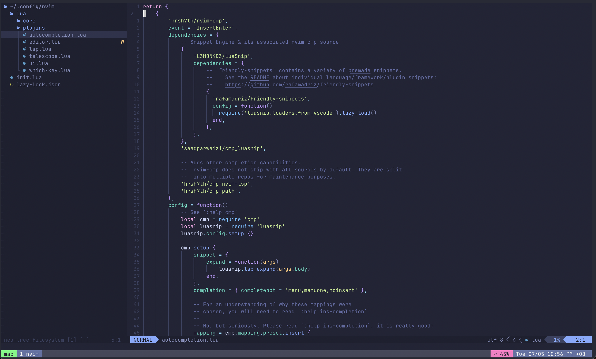

# Dotfiles



## :book: Usage
1. Clone repo
```bash
git clone --bare https://github.com/Javiery3889/dotfiles.git $HOME/.dotfiles
```
2. Set alias in shell `rc` file, e.g. `.bashrc` or `.zshrc`
```bash
alias dotfiles='/usr/bin/git --git-dir=$HOME/.dotfiles/ --work-tree=$HOME'
```
3. Checkout actual contents from the bare repo
```bash
dotfiles checkout
```

> This command may return an error due to existing configuration files, you can either choose to backup or remove these files.

To backup configuration files, you can use the following command to do (credits to this post at [atlassian](https://www.atlassian.com/git/tutorials/dotfiles)):
```bash
mkdir -p .config-backup && \
config checkout 2>&1 | egrep "\s+\." | awk {'print $1'} | \
xargs -I{} mv {} .config-backup/{}
```

4. Ignore untracked files in the local repo
```bash
dotfiles config --local status.showUntrackedFiles no
```
